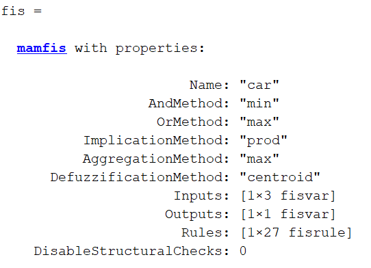
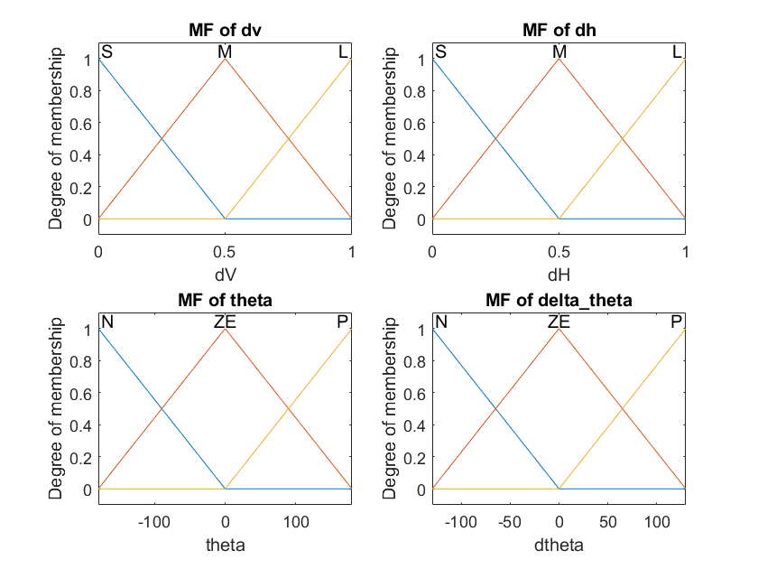
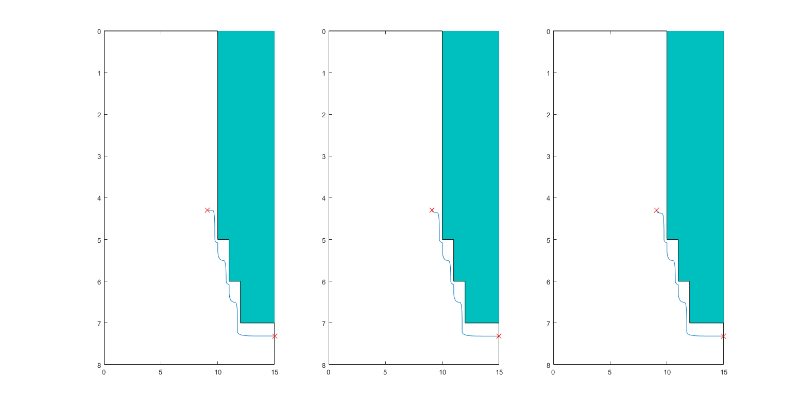

# Introduction

Η εργασία έχει σκοπό τον σχεδιασμό ενός ασαφούς ελεγκτή (FLC), για τον έλεγχο της κίνησης ενός οχήματος με σκοπό την αποφυγή εμποδίων και την οδήγηση του οχήματος με ασφάλεια στην επιθυμητή θέση.

## Inputs - Outputs - Initial Parameters

1. Inputs

    * dH Η οριζόντια απόσταση που ανήκει στο διάστημα [0, 1] (m)

    * dV Η κάθετη απόσταση που ανήκει στο διάστημα [0, 1] (m)

    * theta η διεύθυνση της ταχύτητας του οχήματος που ανήκει στο διάστημα [-180, 180] (deg)

2. Output

    * dtheta η μεταβολή στην διεύθυνση της ταχύτητας του οχήματος που ανήκει στο διάστημα [-180, 180] (deg)

3. Initial Parameters

    * initial_position (x_init, y_init) = (9.1, 4.3)

    * 3 different cases for initial_theta (0, 45, 90)

## FLC Properties

## Membership functions

## Rules

When theta is Negative:

|dh/dv|  S  |  M  |  L  |
|-----|-----|-----|-----|
|  S  |  P  |  P  |  P  |
|  M  |  P  |  P  |  P  |
|  L  |  P  |  P  |  P  |

When theta is Zero:

|dh/dv|  S  |  M  |  L  |
|-----|-----|-----|-----|
|  S  |  P  |  P  |  P  |
|  M  |  P  |  Z  |  Z  |
|  L  |  P  |  Z  |  Z  |

When theta is Positive:

|dh/dv|  S  |  M  |  L  |
|-----|-----|-----|-----|
|  S  |  N  |  N  |  N  |
|  M  |  N  |  N  |  N  |
|  L  |  N  |  N  |  N  |

## Results

Όπως φαίνεται και στην παρακάτω εικόνα τα αποτελέσματα που πετυχαίνουμε είναι ικανοποιητικά και για τις 3 περιπτώσεις και καταφέρνει να φτάσει στην επιθυμητή θέση με μεγάλη ακρίβεια.

