# Introduction

Η εργασία έχει σκοπό τη διερεύνηση της ικανότητας των μοντέλων TSK στη μοντελοποίηση πολυμεταβλητών, μη γραμμικών συναρτήσεων.

## Part 1

Το πρώτο μέρος αφορά ένα σύνολο δεδομένων, που θα χρησιμοποιηθεί για μια απλή διερεύνηση της διαδικασίας εκπαίδευσης και αξιολόγησης μοντέλων αυτού του είδους, καθώς και για μια επίδειξη των τρόπων ανάλυσης και ερμηνείας των αποτελεσμάτων.

Το μοντέλο που χρησιμοποιήθηκε είναι το Airfoil Self-Noise dataset από το UCI repository.

Αρχικά το dataset χωρίστηκε σε 3 μέρη, training, validation και test. Το training κομμάτι έχει μέγεθος το 60% του συνόλου των δειγμάτων και χρησιμοποιήθηκε για την αρχική εκπαίδευση του μοντέλου, το validation έχει μέγεθος το 20% του συνόλου των δειγμάτων και χρησιμοποιήθηκε για την επικύρωση και αποφυγή υπερεκπαίδευσης του μοντέλου, και το test
έχει μέγεθος το 20% του συνόλου των δειγμάτων και χρησιμοποιήθηκε για τον έλεγχο της απόδοσης του μοντέλου.

## Membership functions

Οι τελικές μορφές των ασαφών συνόλων που προέκυψαν μεσω της διαδικασίας εκπαίδευσης για κάθε μοντέλο παρουσιάζονται παρακάτω:

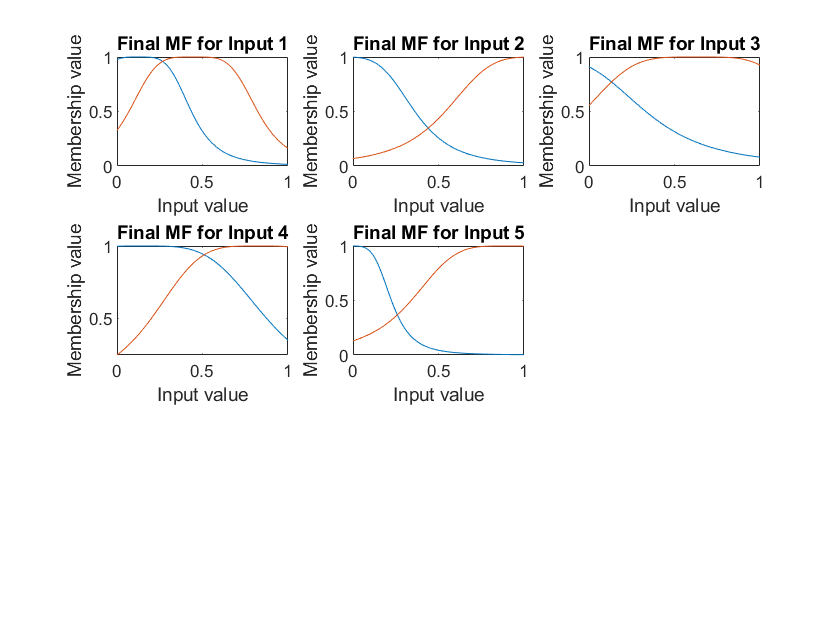
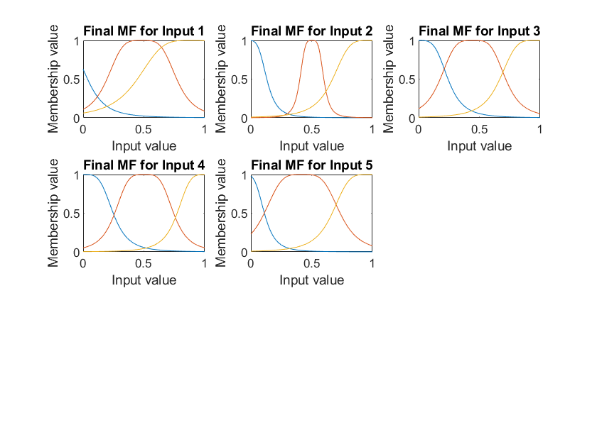
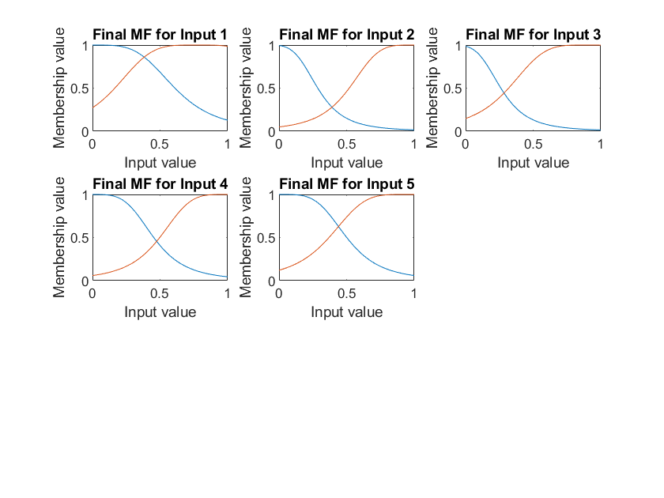
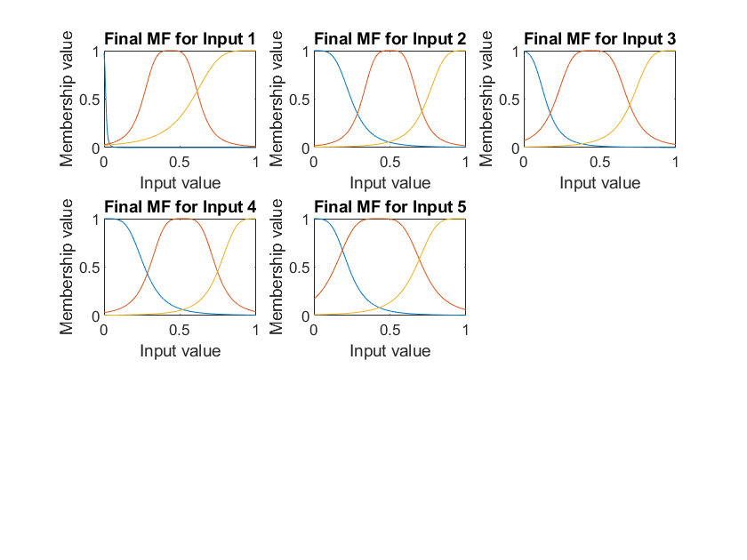

## Learning Curves

Τα διαγράμματα μάθησης (learning curves) όπου απεικονίζεται το σφάλμα του μοντέλου συναρτήσει του αριθμού των επαναλήψεων (iterations) που προέκυψαν για κάθε μοντέλο παρουσιάζονται παρακάτω:

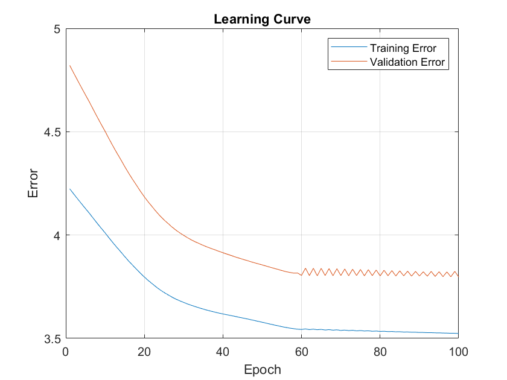
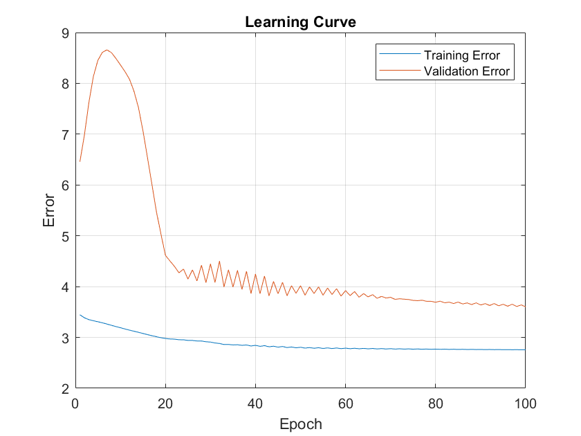
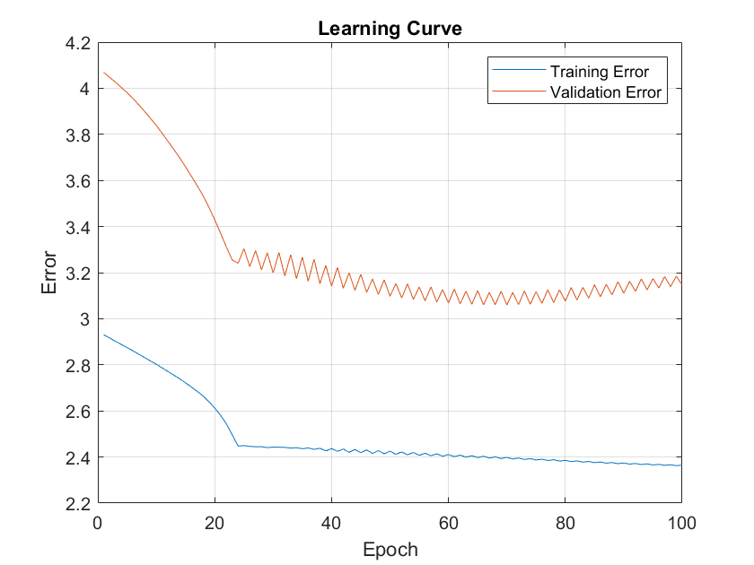
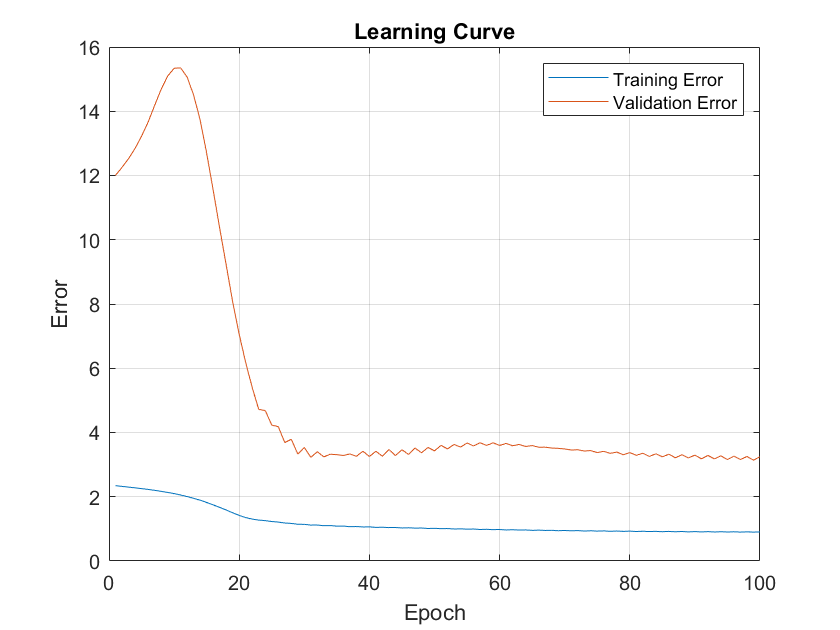

## Prediction Errors

Tα διαγράμματα όπου αποτυπώνονται τα σφάλματα πρόβλεψης που προέκυψαν για κάθε μοντέλο είναι τα παρακάτω:

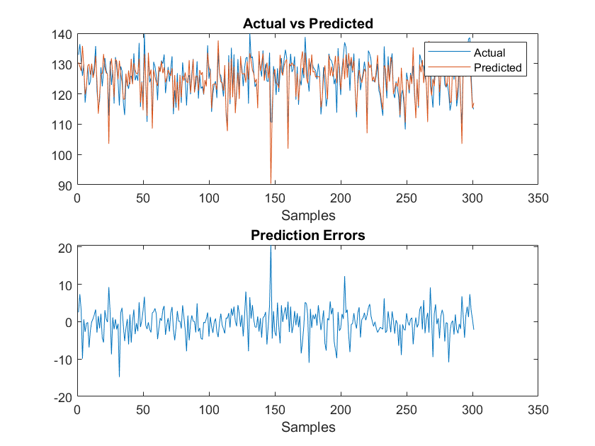
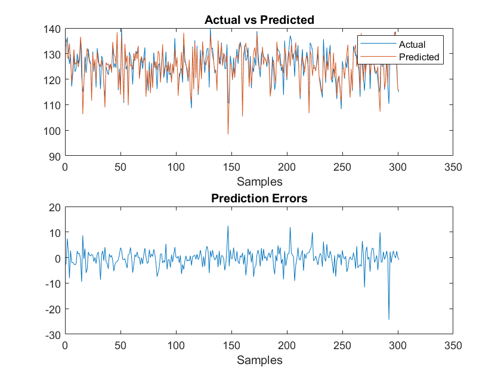
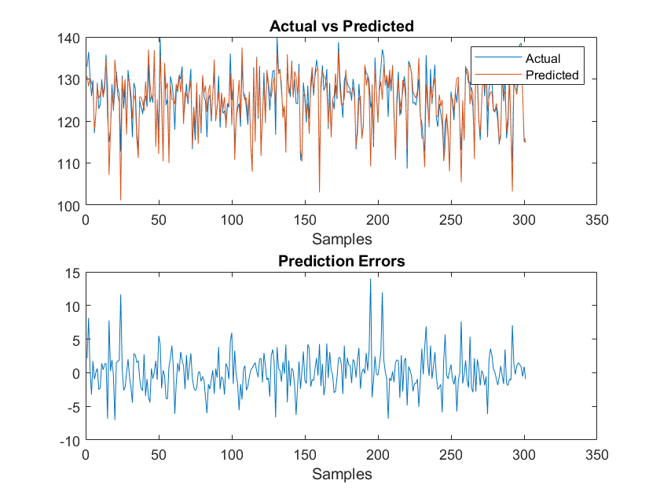
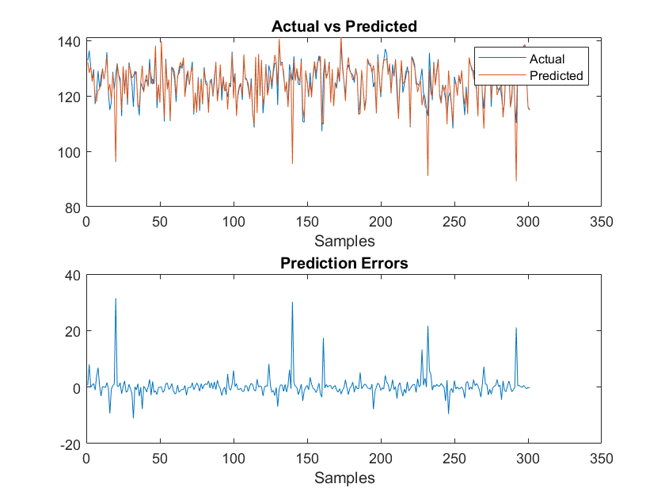

## Metrics

| Metrics   |  model_1_metrics |   model_2_metrics  |  model_3_metrics  |  model_4_metrics   |
|---------- |----------------- |------------------  |------------------|-------------------|
|  RMSE |        3.8397    |         3.5464     |        2.8851     |        3.9961    |
|  NMSE |        0.3379    |        0.28824     |       0.19076     |       0.36598    |
| NDEI |       0.58129    |        0.53688     |       0.43676     |       0.60496    |
|  R2  |        0.6621    |        0.71176     |       0.80924     |       0.63402  |
| time(s) |     3.0951      |  26.8722      |   9.3779  |  892.8765 |

Παρατηρούμε ότι το μοντέλο 3 επιτυγχάνει καλύτερα αποτελέσματα ενώ ταυτόχρονα ο χρόνος για την εκπαίδευση του είναι αρκετά σύντομος.

Επιπλέον σε ότι αφορά τη μορφή εξόδου μπορεί να παρατηρηθεί πως η Singleton προσφερεί πιο σταθερή απόδοση ανεξαρτήτως πλήθους συναρτήσεων συμμετοχής σε αντίθεση με την polynomial που πέτυχε πολύ καλύτερα αποτελέσματα με 2 αντί για 3.

Με βάση τις καμπύλες μάθησης δεν υπήρξε υποψία για υπερεκπαίδευση.

## Part 2

Στο δεύτερο μέρος μελετάμε ένα πρόβλημά πολλαπλών διαστάσεων, όπου το σύνολο δεδομένων μας περιλαμβάνει χιλιάδες δεδομένα, όπου το καθένα έχει 81 χαρακτηριστικά.

Το μοντέλο που χρησιμοποιήθηκε είναι το Superconductivity dataset από το UCI repository.

Για να μειώσουμε τη διαστασιμότητα θα πρέπει να επιλέξουμε συγκεκριμένα χαρακτηριστικά και να βελτιστοποιήσουμε την επιλογή για τον αριθμό των χαρακτηριστικών που θα χρησιμοποιήσουμε καθώς και την ακτίνα επιρροής των clusters.

Για να βρεθούν οι βέλτιστοι παράμετροι χρησιμοποιήθηκαν όλοι οι πιθανοί συνδυασμοί για:

Αριθμός χαρακτηριστικών: [8, 10, 12, 14, 16]
Ακτίνα επιρροής: [0.2, 0.4, 0.6, 0.8]

με μικρότερο σφάλμα να επιτυγχάνει ο συνδυασμός

|Optimal Number of Features | Optimal Radius |
|---------------------------|-----|
| 10 | 0.2 |

Αφού εκπαιδεύτηκε το τελικό μοντέλο με τις βέλτιστες παραμέτρους αυτές  μπορούν να δοθούν τα παρακάτω διαγράμματα.

## Prediction Errors Optimized Model

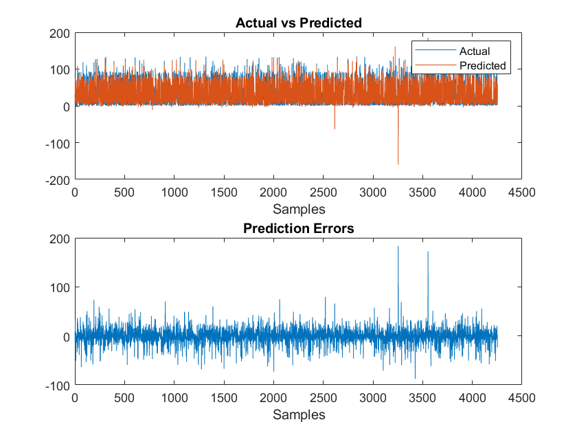

## Learning Curves Optimized Model

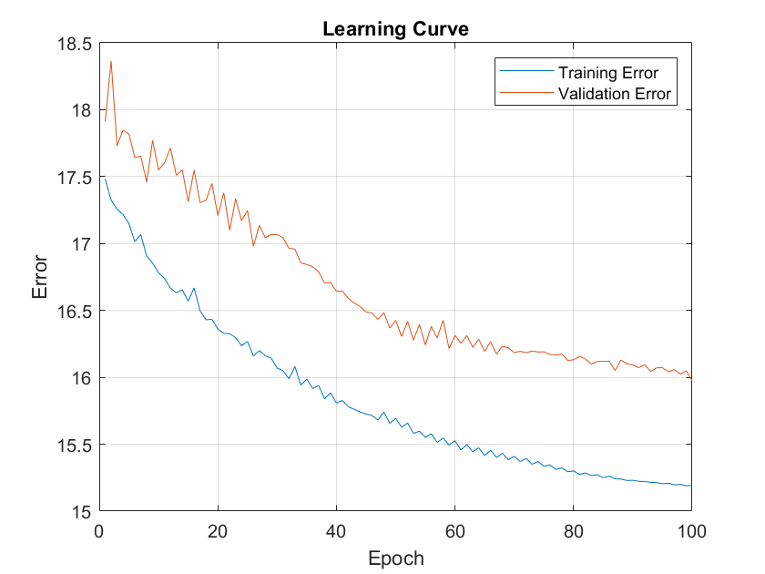

## Membership functions Optimized Model

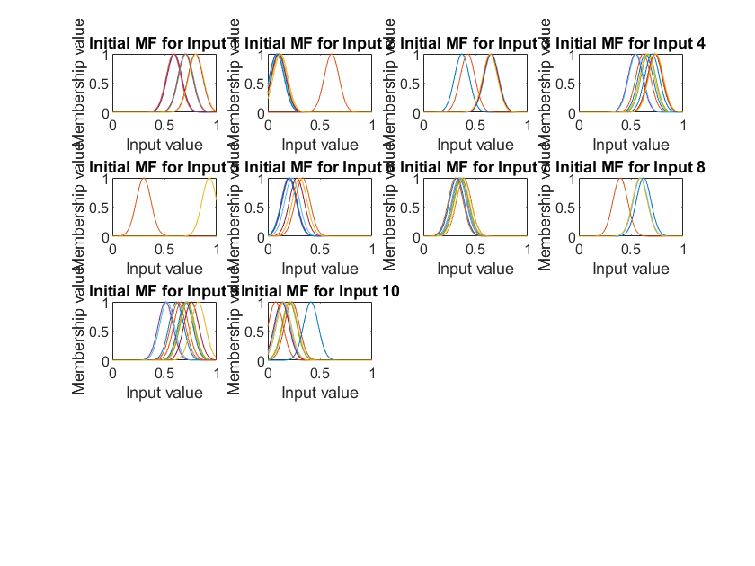

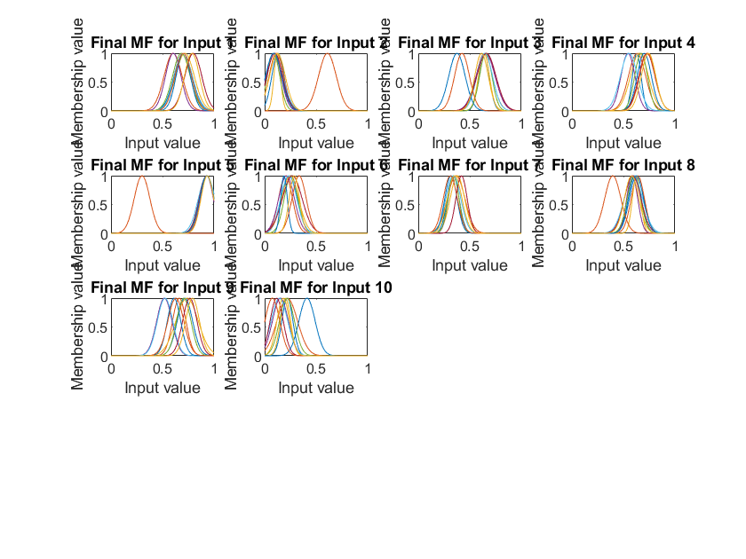

## Metrics Optimized Model

| Metrics   |  opt_model_metrics |
|---------- |----------------- |
|  RMSE |        15.797      |
|  NMSE |        0.21725    |
| NDEI  |        0.4661     |
|  R2   |        0.78275    |
| time(s) |     108.4129      |

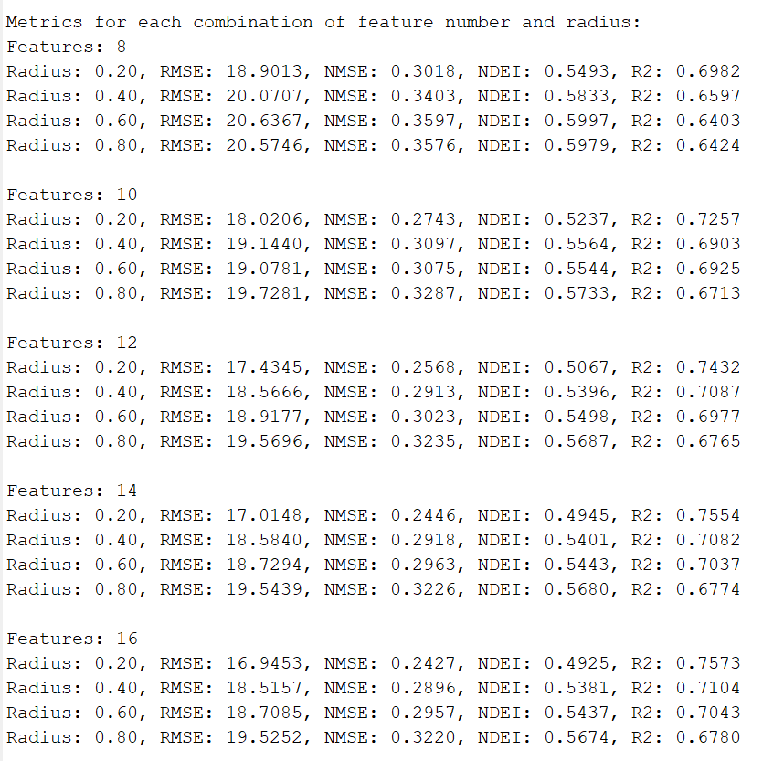

Το βέλτιστο μοντέλο μας χαρακτηρίζεται από 10 ψαρακτηριστικά και ακτίνα επιρροής 0.2. Τα RMSE και NMSE τα οποία αφορούν την ακρίβεια των προβλέψεων έχουν χώρο βελτίωσης ειδικά το πρώτο. Η τιμή NDEI 0.4661 υποδηλώνει ότι το μοντέλο καταφέρνει να αποτυπώσει περίπου το 46,61% της διακύμανσης των παρατηρήσεων που υπάρχουν στα δεδομένα. Τέλος η τιμή R2 του 0.78275 υποδηλώνει ότι περίπου το 78.275% της διακύμανσης της εξαρτημένης μεταβλητής (στόχος) εξηγείται από τις ανεξάρτητες μεταβλητές (χαρακτηριστικά) που χρησιμοποιήθηκαν στο μοντέλο. Αυτό σημαίνει ότι το μοντέλο έχει σχετικά καλή προσαρμογή στα δεδομένα.

Γενικότερα παρατηρείται μια βελτίωση του RMSE όσο αυξάνεται ο αριθμός των χαρακτηριστικών και μειώνεται η ακτίνα επιρροής. Κατά τη σύγκριση των συνδυασμών ο βέλτιστος συνδυασμός που επιλέξαμε πέτυχε το 4ο καλύτερο RMSE, NMSE, R2 ενώ το NDEI ήταν από τα χειρότερα μεταξύ των συνδυασμών.
